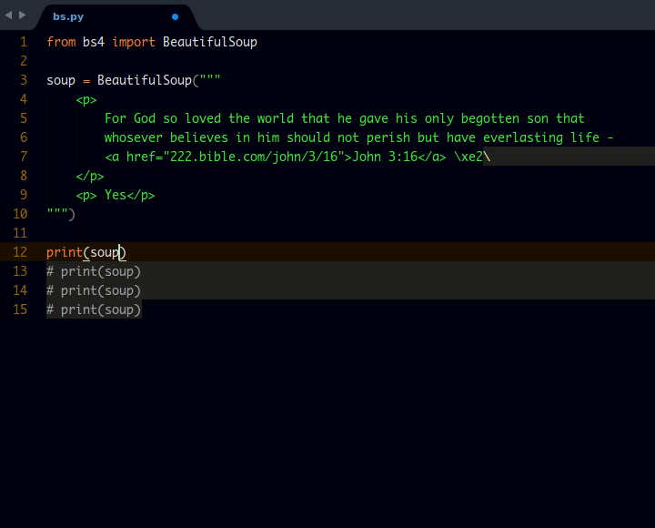

# Beautiful Soup Completion

## About

Completion suggestions for beautiful soup using sublime text

## Screenshot

## How to Use
Just type and the methods would pop up. Press `	TAB` or `ENTER` to select.

## Installation
> Important: You need to have `Package Control` installed first on your sublime text which can be found at the [Package Contol Website](http://packagecontrol.io)

Go to: `Preferences` --> `Package Control` --> `Install Package` --> then search `Beautiful Soup Completion` and click it.

The package will be installed and ready for use.

## Contributing

All contributions are welcome. fork me on [Github](https://github.com/tushortz/Beautiful-Soup-Completion) and create a `pull` request. Any suggestions or bugs, please let me know.

## License
Copyright © 2016 Taiwo Kareem | taiwo.kareem36@gmail.com.

Read **license.txt**

## Acknowledgements
All thanks be to God my creator. Without him, this wouldn't be possible.